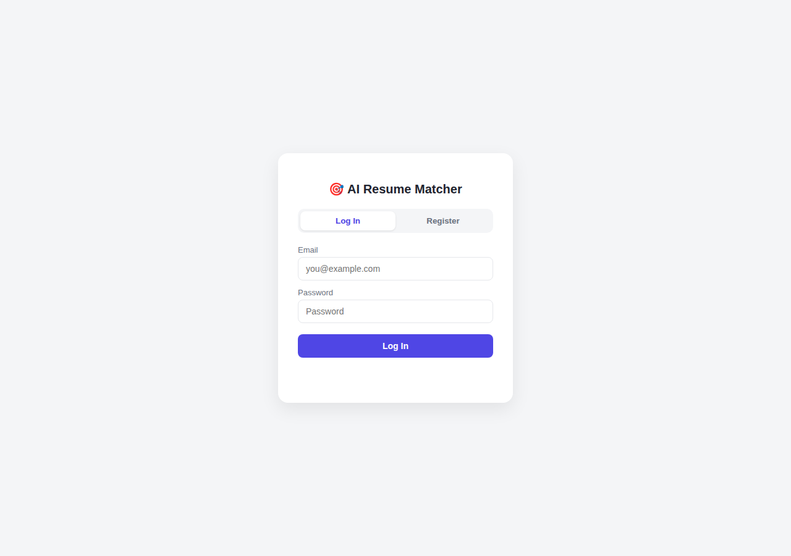
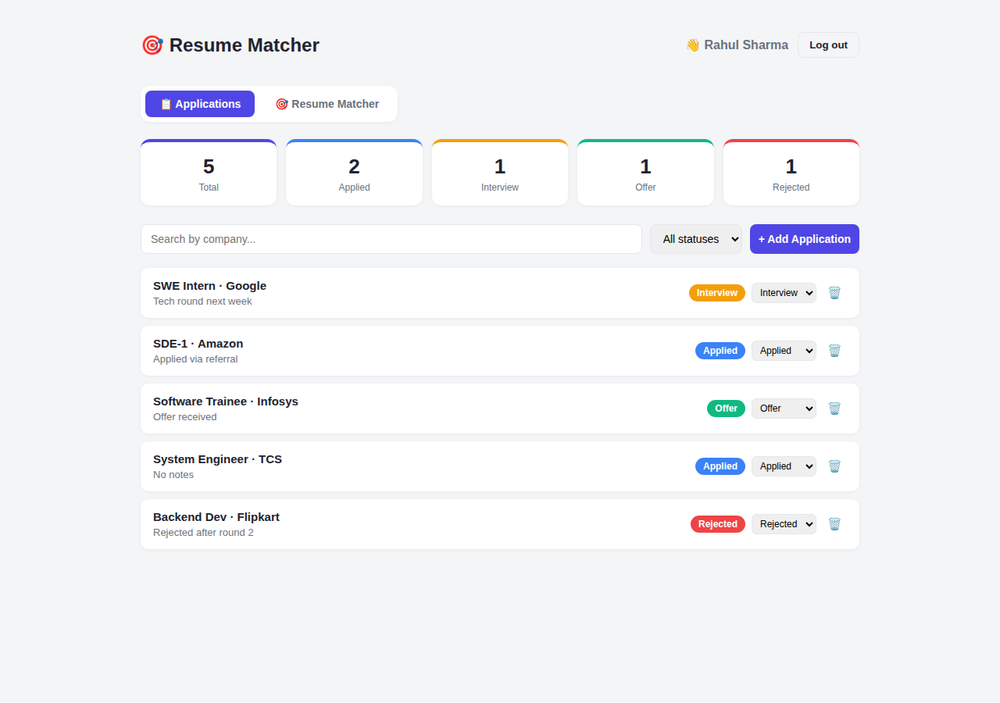
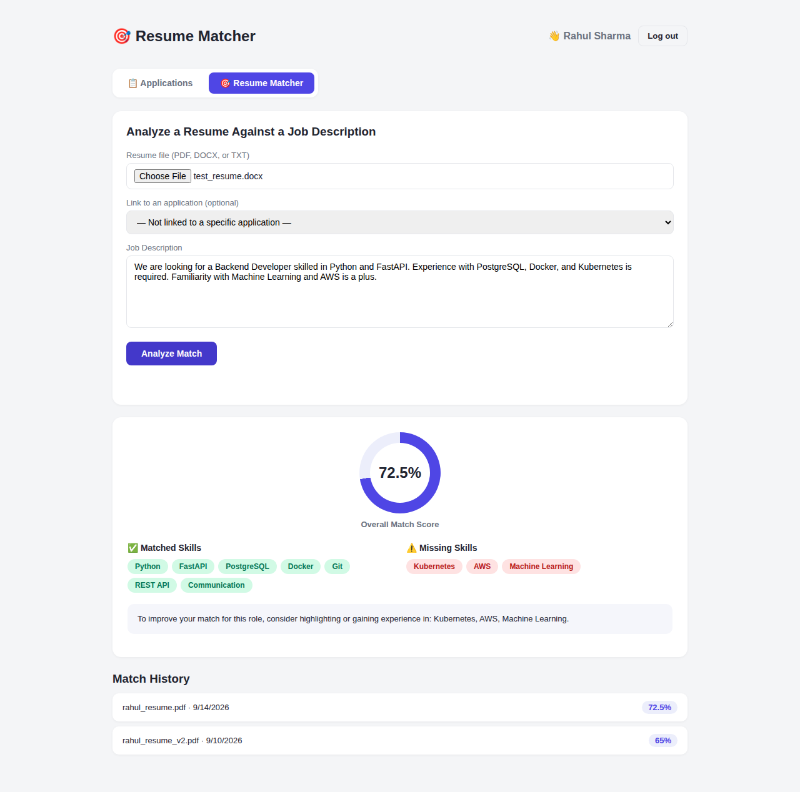

# AI Resume Matcher & Job Application Assistant

A full-stack web app that tracks job applications **and** analyzes how well
a resume matches a job description — extracting skills with NLP, computing
a match score, and highlighting what's missing.

**Backend:** FastAPI + SQLAlchemy + SQLite + JWT auth
**NLP:** spaCy (skill extraction) + scikit-learn (TF-IDF similarity)
**Frontend:** Vanilla HTML/CSS/JS (served by FastAPI, no build step)

## Screenshots

| Login | Application Dashboard | Resume Match Result |
|---|---|---|
|  |  |  |

## Getting Started

### 1. Clone and install

```bash
git clone https://github.com/<your-username>/ai-resume-matcher.git
cd ai-resume-matcher
python -m pip install -r requirements.txt
```

### 2. Configure your environment

```bash
cp .env.example .env
```
Then open `.env` and replace the placeholder with your own random secret string.

If you hit a `bcrypt`/`passlib` error on first run:
```bash
python -m pip uninstall bcrypt -y
python -m pip install bcrypt==4.0.1
```
(This is already pinned in requirements.txt, so a fresh install shouldn't need this.)

### 3. Run

```bash
python -m uvicorn main:app --reload
```

Open **http://127.0.0.1:8000/** — the app loads there.
API docs: **http://127.0.0.1:8000/docs**

## Project structure

```
resume_matcher/
├── main.py               # FastAPI app + all routes
├── models.py             # SQLAlchemy models (User, Application, MatchResult)
├── schemas.py            # Pydantic request/response schemas
├── database.py           # DB engine/session setup
├── auth.py               # JWT token creation & verification
├── nlp_engine.py         # Skill extraction + TF-IDF match scoring
├── file_parser.py        # PDF/DOCX/TXT text extraction
├── skills_data.py        # Curated skills dictionary used for matching
├── requirements.txt
├── .env.example          # Template for your JWT secret
├── .gitignore
├── LICENSE
├── frontend/
│   ├── index.html
│   ├── style.css
│   └── app.js
├── screenshots/          # Used in this README
└── .github/workflows/    # CI: installs deps + compile-checks the project
```

## How the matching works

1. Your resume (PDF/DOCX/TXT) is parsed into plain text.
2. Both the resume and the job description are scanned for known skills
   using spaCy's `PhraseMatcher` against the dictionary in `skills_data.py`
   (falls back to regex matching automatically if spaCy isn't installed).
3. **Skill coverage** = the fraction of the job's required skills that
   also appear in your resume.
4. **Text similarity** = TF-IDF cosine similarity between the full resume
   and job description text (captures context beyond just keyword hits).
5. **Final match score** = 65% skill coverage + 35% text similarity.

## Features

- JWT-secured registration/login — every request is verified server-side,
  no client-supplied user IDs
- Job application tracking (add/search/filter/update/delete, dashboard)
- Resume vs. job description matching with a visual score, matched/missing
  skill chips, and improvement suggestions
- Match history so you can see how your resume performs across applications
- Optionally link a match analysis to a specific tracked application

## API Endpoints

| Method | Endpoint                | Auth | Description |
|--------|---------------------------|------|--------------|
| POST   | `/register`               | No   | Create a new user |
| POST   | `/login`                  | No   | Log in, returns a JWT |
| GET    | `/me`                     | Yes  | Current user info |
| POST   | `/applications`           | Yes  | Add a job application |
| GET    | `/applications`           | Yes  | List applications (optional `?status=`) |
| GET    | `/applications/search`    | Yes  | Search by `?company=` |
| GET    | `/applications/{id}`      | Yes  | Get one application |
| PUT    | `/applications/{id}`      | Yes  | Update status (`?status=`) |
| DELETE | `/applications/{id}`      | Yes  | Delete an application |
| GET    | `/dashboard`               | Yes  | Status counts summary |
| POST   | `/match/analyze`          | Yes  | Upload resume + JD, get match analysis |
| GET    | `/match/history`          | Yes  | Past match analyses |

All `Yes`-auth endpoints require an `Authorization: Bearer <token>` header,
which the frontend handles automatically once you're logged in.
